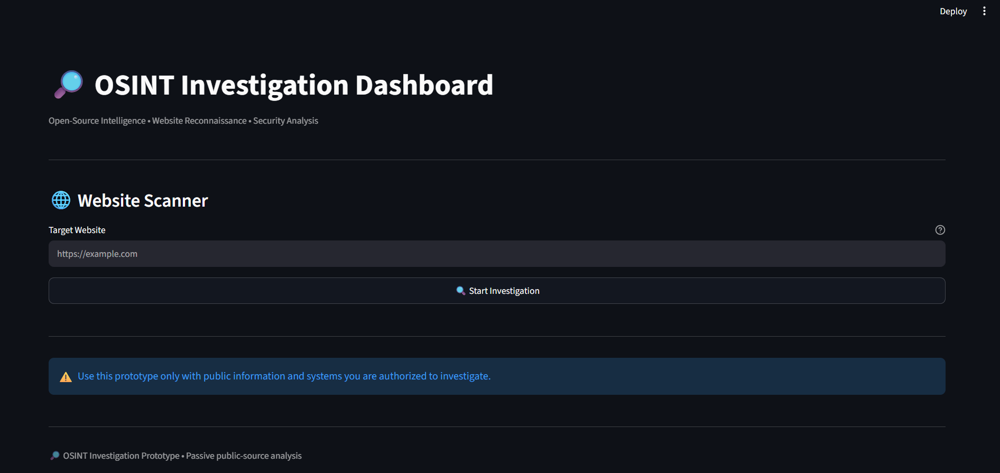
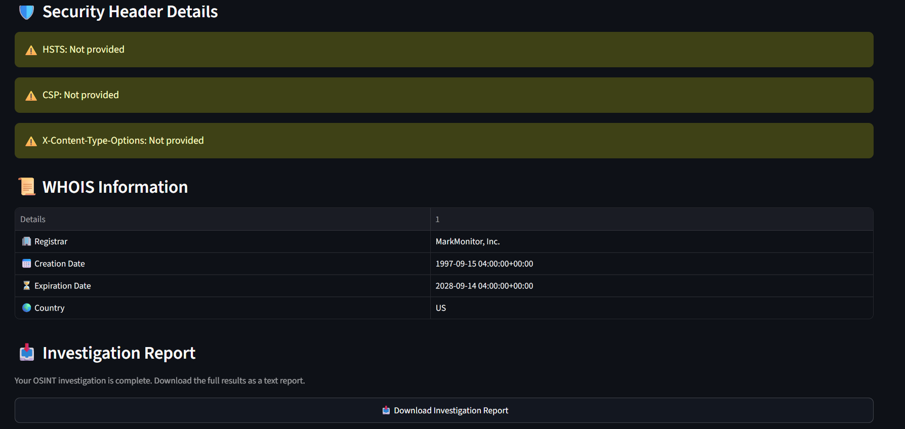
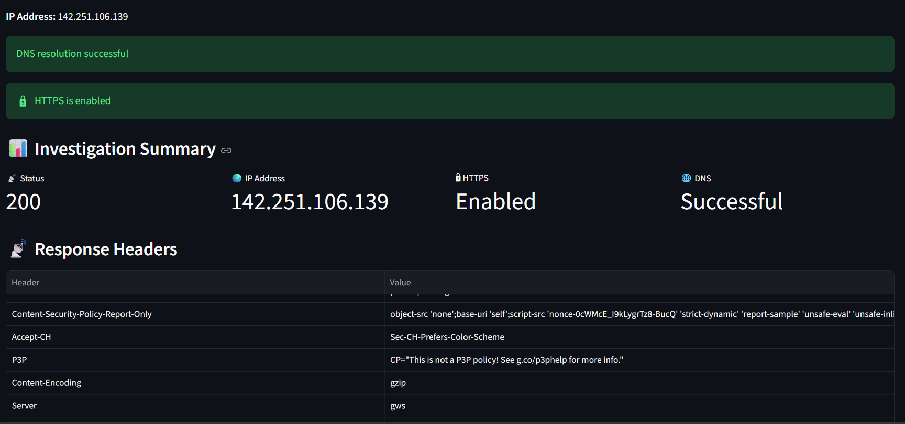
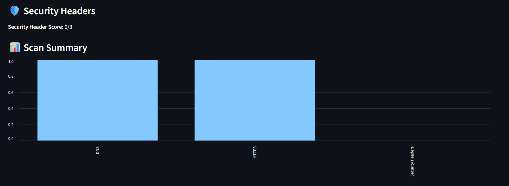
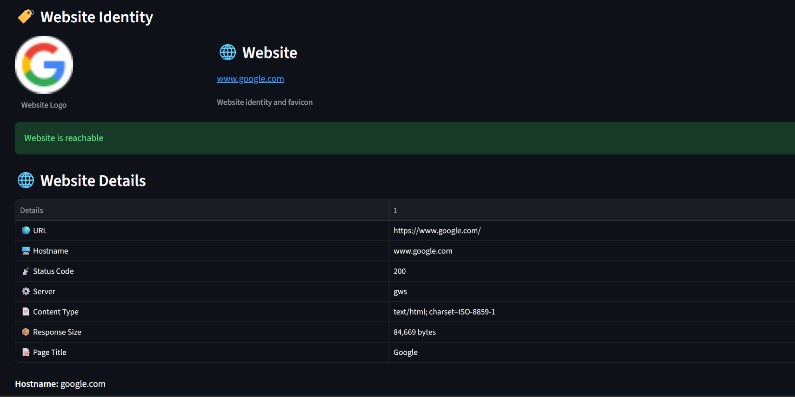

🔎 OSINT Investigation Dashboard

A Python and Streamlit-based Open-Source Intelligence (OSINT) web investigation dashboard for analyzing publicly accessible information about websites.

📌 Project Overview

This project provides a simple web-based interface for performing basic website reconnaissance and security analysis.

The dashboard accepts a website URL and collects information such as DNS/IP details, HTTP response information, security headers, WHOIS data, redirects, favicon, and a website screenshot.

🚀 Features

- 🌐 Website URL analysis
- 📡 HTTP status and response information
- 🔗 Redirect detection
- 🌍 DNS and IP address lookup
- 🔒 HTTPS detection
- 🛡️ Security header analysis
- 📋 Response header inspection
- 📜 WHOIS information
- 🏷️ Website favicon/logo detection
- 🖼️ Website screenshot
- 📊 Investigation summary and charts
- 📥 Downloadable investigation report

🛠️ Technologies Used

- Python
- Streamlit
- Requests
- Pandas
- Python-WHOIS
- Playwright
- Socket / DNS

📂 Project Structure

OSINT-Dashboard/
│
├── app.py
├── requirements.txt
└── README.md

⚙️ Installation

1. Clone the repository

git clone YOUR_GITHUB_REPOSITORY_URL
cd OSINT-Dashboard

2. Install dependencies

python -m pip install -r requirements.txt

3. Install Playwright Chromium

python -m playwright install chromium

4. Run the application

python -m streamlit run app.py

The application will open in your browser.

🔍 How to Use

1. Enter a website URL.
2. Click Start Investigation.
3. Review the collected information.
4. Check DNS/IP, HTTP, security headers, WHOIS, redirects, favicon, and screenshot results.
5. Download the investigation report if required.

⚠️ Limitations

- Results depend on the information publicly returned by the target website.
- WHOIS information may be unavailable or privacy-protected.
- Security headers can differ between pages and responses.
- Some websites may block automated requests.
- Screenshots may fail when a website prevents automated browser access.

🔐 Responsible Use

This project is intended for educational purposes, authorized security testing, and analysis of publicly accessible information.

Only investigate websites and systems that you have permission to test. Do not use the tool to bypass access controls or conduct unauthorized attacks.

🔮 Future Improvements

- More security-header checks
- Technology/framework detection
- SSL/TLS certificate analysis
- Subdomain discovery
- Port/service information
- Improved report formats such as PDF
- Better error handling
- Historical scan comparison
- More detailed security scoring

👨‍💻 Project Status

Status: Working Prototype

The project is currently focused on website reconnaissance and basic OSINT/security analysis.
## 📸 Screenshots

### Dashboard

### Investigation Report

### Response Headers

### Security Headers

### Website Information
